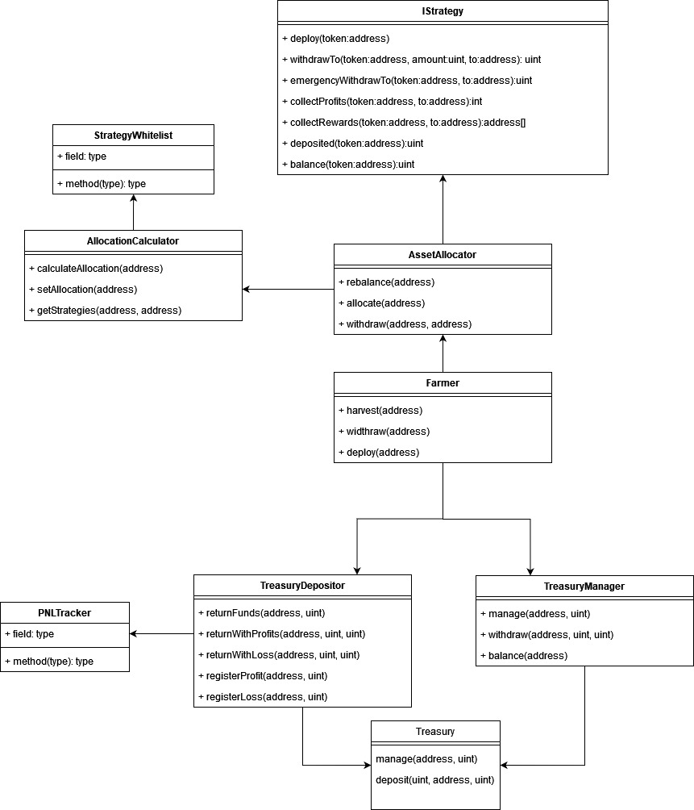

# Automatic Treasury Allocation (ATA)

## Farmer contract
The Farmer contract pulls funds from the TreasuryManager contract
depending on predetermined amount. It can be based on a % of total holdings,
up to a limit or with a reserve amount.

It has 2 main functions to deploy funds: rebalance and allocate

### Rebalance
Rebalance will rebalance the allocations in every strategy to fit the 
allocation given by the strategists. This uses the AssetAllocator. 
It will also sync PNL with the treasury so the excess reserve stays in sync
with the amount deployed in the strategies and accounts for profits or losses.

This function can be called by anyone every x amount of time or anytime
by strategist. 

### Allocate
This functions sends funds in the treasury to the strategies with no rebalances.
This functions is used most of the time to avoid slippage going in-out of strategies.

This function can be called by anyone any time.

### Automation
The automation of allocation can be achieved using a Keeper infrastructure like
[Gelato Network](https://www.gelato.network/) which will have robots call both function
and allocate funds automatically and in a decentralised manner.

## AssetAllocator
The AssetAllocator handle deploying and withdrawing funds to multiple strategies.
It also handles rebalancing strategies with losses, profits and slippages. It takes
funds from the caller and send them to the strategies.

## AssetCalculator
The asset calculator does the math to tell the AssetAllocator how many tokens have to be
sent to the strategies. 

## StrategyWhitelist
For a strategy to be added to the AssetCalculator it first has to be whitelisted by
the architects.

