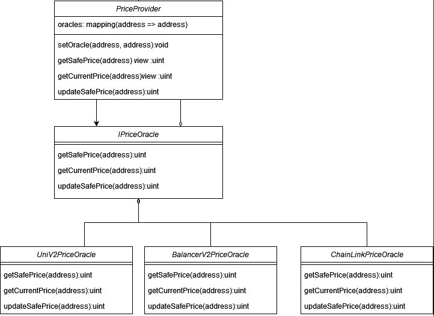

# Oracles

We have developped a suite of contracts to fetch 
on-chain price of assets in a flash-loan resistant manner
and self-maintaining. The price Provider acts as a proxy
which queries price from underlying oracles depending on an internal 
mapping.

**Specifications**
- The price returned is denominated in FTM.
- The price always has 18 decimals.
- PriceProvider and all the underlying contracts implements the IPriceOracle interface.

## IPriceOracle interface
The IPriceOracle interface is made of 3 functions.
### getSafePrice(address _token) view returns (uint)
This method returns a flashloan resistant price.
### updateSafePrice(address _token) returns (uint)
This method returns a flashloan resistant price, but doesn't 
have the view modifier which makes it convenient to update
a uniswap oracle which needs to maintain the TWAP regularly.
You can use this function while doing other state changing tx and 
make the callers maintain the oracle.
### getCurrentPrice(address _token) view returns (uint)
This method has no guarantee on the safety of the price returned. It should only be 
used if the price returned does not expose the caller contract to flashloan attacks.

| Function          | Flashloan safe            | View  |
|-------------------|---------------------------|-------|
| getSafePrice      | Yes                       | Yes   |
| updateSafePrice   | Yes                       | No    |
| getCurrentPrice   | No                        | Yes   |
