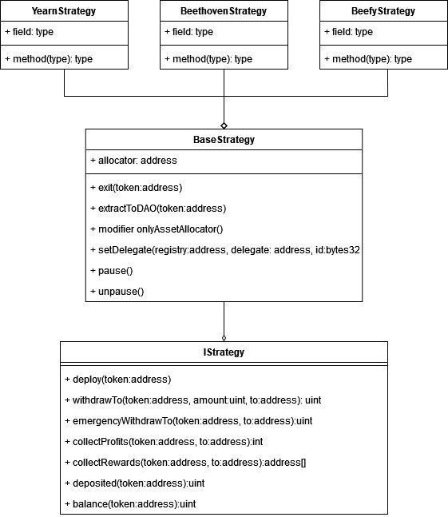

# Strategies

Strategies are developed to gain yields using the treasury funds.
Funds are sent into the strategy by the AssetAllocator.

## IStrategy
Strategies should implement the IStrategy interface to be usable
with the AssetAllocator.

See IStrategy contract for more dev comments.

## BaseStrategy
Strategies should extend the BaseStrategy contract to have the
proper permissions and pausable functionalities already
integrated.

